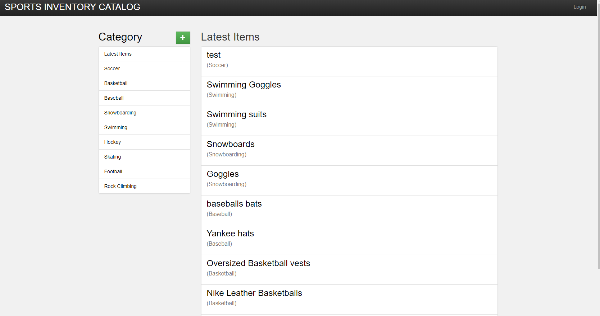
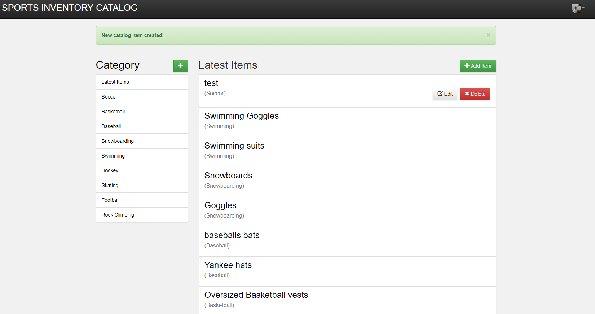

# Project:Item-Catalog
We are building a sports catalog

## Key Functionality
  - Google Authentication
  - Easy to add, update, create, delete information.
  - - Users can edit and delete items only created by them
  - Easily accessible data with JSON Endpoints

### Prerequisites
  - Python 2.7
  - requirements.txt

### How to Run
- Clone this repository.
- Initialize the database using 
` python populate_database.py`
- Run the application using the following command
` python application.py`
- Open your browser and go to this url http://localhost:5000

## JSON endpoints
#### Returns JSON of all items in all catalogs
`/api/v1/catalog/JSON`
#### Returns JSON for all categories
`/api/v1/categories/JSON`
#### Returns JSON of a specific category and an item 
`/api/v1/categories/<int:category_id>/item/<int:catalog_item_id>/JSON'

### Acknowlegements
Following code was used as a starting point for the work where a book shelf catalog was developed. 
'https://github.com/br3ndonland/udacity-fsnd-flask-catalog'

Include changes for the new google sign-on method 

